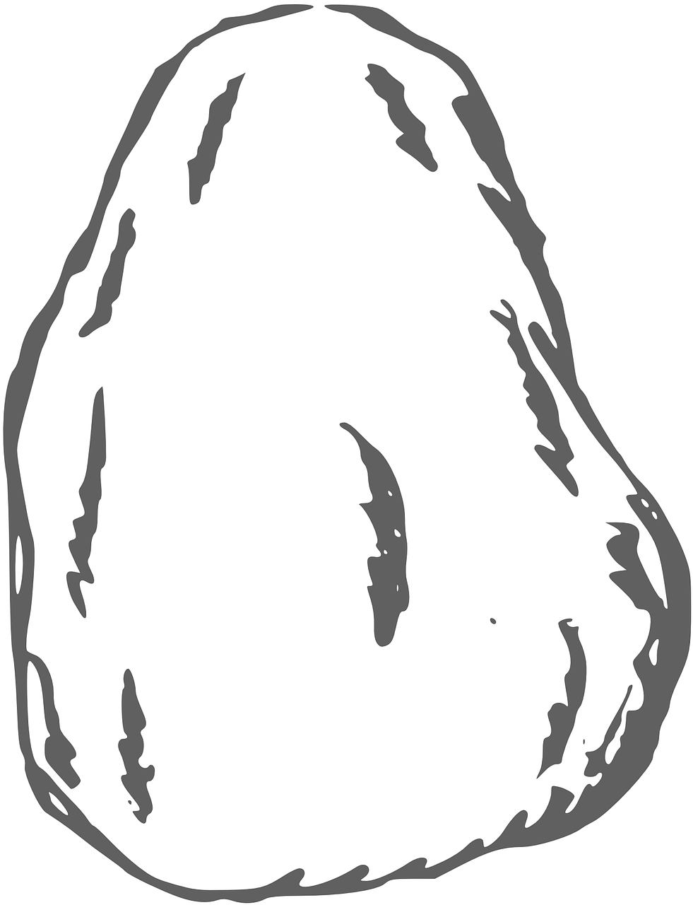

#   Rock, Paper, Scissors Game

***Try Demo:*** [https://codetracklift.github.io/rock-paper-scissors/](https://codetracklift.github.io/rock-paper-scissors/)

>**Skills Utilized**:
<ol>
    <li>Languages: HTML, CSS, JavaScript</li>
    <li>CSS Flex</li>
    <li>DOM Manipulation</li>
    <li>Event Listeners</li>
    <li>Text Input Validation</li>
</ol>

## About
This is my first JavaScript project and was completed as part of The Odin Project Foundations course on Day 22 of #100DaysOfCode.

>**Project Objectives**:
<ol>
    <li>Create a 'Rock, Paper, Scissors' game</li>
    <li>Game will have a user interface</li>
    <li>Accepts text and button inputs</li>
    <li>Text input will have validation</li>
    <li>Score tracking and 5-round winner</li>
</ol>

>**Custom Features**:
<ol>
    <li>Custom scoreboard</li>
    <li>Tracks: rounds, wins, losses, ties</li>
    <li>Calculates percent won</li>
    <li>Reset Stats button</li>
</ol>

## How to Run
This Rock, Paper, Scissors game accepts mouse and keyboard inputs.

## Future Roadmap
This is a progression project, no further development is anticipated.

## MIT License

Copyright (c) 2022 Pete Chu  ***[codeByPete](https://www.codebypete.com/)***

Permission is hereby granted, free of charge, to any person obtaining a copy of this software and associated documentation files (the "Software"), to deal in the Software without restriction, including without limitation the rights to use, copy, modify, merge, publish, distribute, sublicense, and/or sell copies of the Software, and to permit persons to whom the Software is furnished to do so, subject to the following conditions:

The above copyright notice and this permission notice shall be included in all copies or substantial portions of the Software.

THE SOFTWARE IS PROVIDED "AS IS", WITHOUT WARRANTY OF ANY KIND, EXPRESS OR IMPLIED, INCLUDING BUT NOT LIMITED TO THE WARRANTIES OF MERCHANTABILITY FITNESS FOR A PARTICULAR PURPOSE AND NONINFRINGEMENT. IN NO EVENT SHALL THE AUTHORS OR COPYRIGHT HOLDERS BE LIABLE FOR ANY CLAIM, DAMAGES OR OTHER LIABILITY, WHETHER IN AN ACTION OF CONTRACT, TORT OR OTHERWISE, ARISING FROM, OUT OF OR IN CONNECTION WITH THE SOFTWARE OR THE USE OR OTHER DEALINGS IN THE SOFTWARE.
